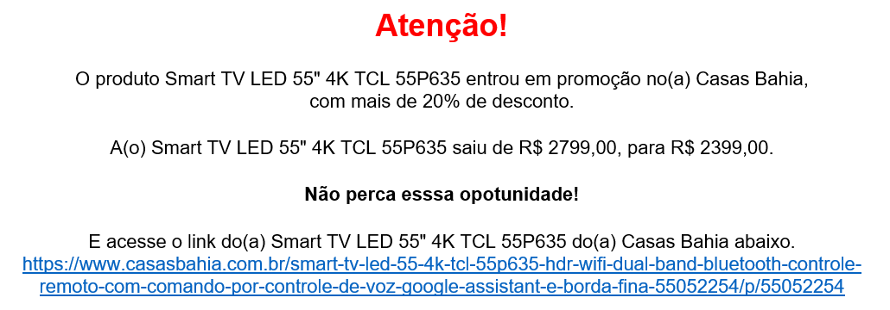

# Projeto Automação Web - Busca de Preços    

### Descrição:

- Imagine a necessidade de comparar preços de varios fornecedores, para seus insumos/produtos.
- Nessa hora, você vai constantemente buscar nos sites desses fornecedores os produtos disponíveis e o preço, afinal, cada um deles pode fazer promoção em momentos diferentes e com valores diferentes.
- Com isso o objetivo é descobrir o produto mais barato e atualizar isso em uma planilha.
- Caso o valor seja 20% (ou mais) abaixo do preço original, queremos também ser avisados por e-mail para poder agir rápido e aproveitar essa promoção.
- No nosso caso, vamos fazer com produtos comuns em sites comuns, mas a ideia é a mesma.

### O que temos disponível?

- Planilha de Produtos, com os nomes dos produtos e o link em cada loja, além do preço original cadastrado.

### O que devemos fazer?
- Criar uma planilha com o menor preço encontrado, o nome do Local onde foi encontrado esse preço e seu respectivo link.
- Enviar um e-mail para compras com a notificação do menor preço encontrado e o link de compra, caso o preço encontrado esteja com 20% ou mais de desconto em relação ao preço original.

### Adicional:
- Podemos colocar esse programa para rodar de 3 em 3 horas ou então todo dia as 10hrs da manhã. Podemos fazer isso via agendador de tarefas do Windows (nesse caso seria somente transformar o codigo em um executavel) ou então deixar o código rodando em background com um time.sleep(tempo)

### ex. E-mail enviado em caso de promoção:
